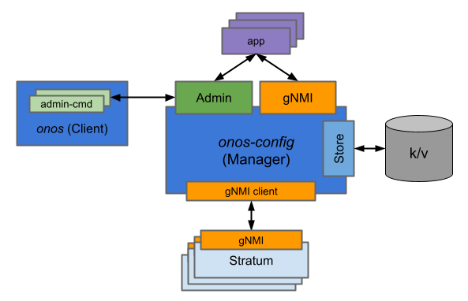

# onos-config

ONOS Configuration subsystem built using the µONOS architecture

## Design Objectives
gNMI provides transactionality with respect to a single device; all configuration operations specified as part of a 
single batch are all applied or none of them are. The core capability of the configuration platform should build on 
this gNMI feature to:

* Provide ability to apply a batch of operations (via NB gNMI API) targeted at multiple devices 
  to be performed as a transaction; either all changes are applied to all devices or none of 
  the changes are applied to any of the devices.
* Track configuration change transactions applied to a set of devices over time and allow 
  rollback (via NB admin API) to previous configuration checkpoints demarcated by the transactions.

The above features are the principal objectives for the configuration management platform. 
Second order objectives are as follows:

* Support high-availability and distributed operation, including rolling upgrades
* Support networks comprising of ~50 devices, ~5000 ports and rate of ~10K incremental 
  configuration transactions per day

### Additional Features (to be integrated with the above)
The following set of features will be required to support the real-world use-cases, 
but may not necessarily be part of the code configuration subsystem and instead can be 
provided as additional layers:

* Ability to preload initial configuration about devices that have not yet been discovered - 
  or even deployed
* Dry run capability - validate configuration with respect to model, but also with respect 
  to existing business constraints or policies
* Import existing device configuration
* Configuration Intents - ability to translate high-level (possibly network-wide) 
  configuration specifications into lower-level (device-specific) operations

## Key Tenets
* Principal northbound API for the subsystem will be gNMI and gNOI.
   * These interfaces are already accepted standards and are well-defined, low-profile interfaces 
     with support for transaction semantics.
   * YANG models that will be exposed as part of the NB API are yet to be determined (or defined).
* Enhanced northbound API will be a gRPC service providing access to administrative functionality.
   * Applications can navigate the change-log and roll-back various changes as they were 
     previously submitted via gNMI
* Southbound API for the subsystem will be gNMI and gNOI.
   * This will allow direct use with Stratum-compliant switches without requiring an adaptation layer.
   * Adapters can be created for devices that do not directly support gNMI/gNOI interfaces. 
     Such adapters can be deployed either as proxy agents or potentially can be hosted on the devices themselves.
* Diagnostic gRPC service will allow for inspection of internal state using various remote tools.
   * This interface is not subject to backward compatibility constraints.  
* The subsystem will be designed as a separate entity to allow its use with the existing 
  ONOS 2.0 architecture and to fit with the NG ONOS architecture.

## High-Level Design

## Additional Documentation
* [How to contribute](docs/contributing.md) to onos-config project
* [How to build](docs/build.md) onos-config server, related commands and Docker image
* [How to run](docs/run.md) onos-config server and related commands
* [How to deploy](docs/deployment.md) onos-config in a Kubernetes cluster
* [Developer workflow summary](docs/dev_workflow.md) for onos-config project
* [Contacts and Meetings](docs/community-info.md) for onos-config project
