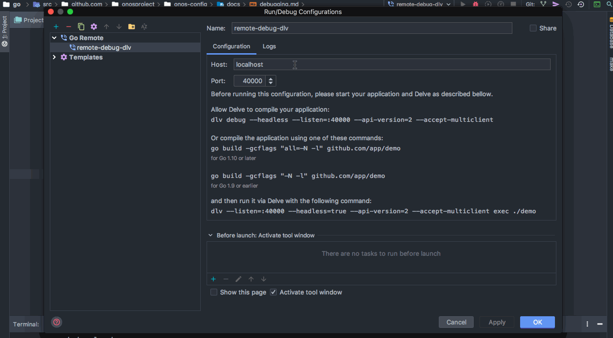
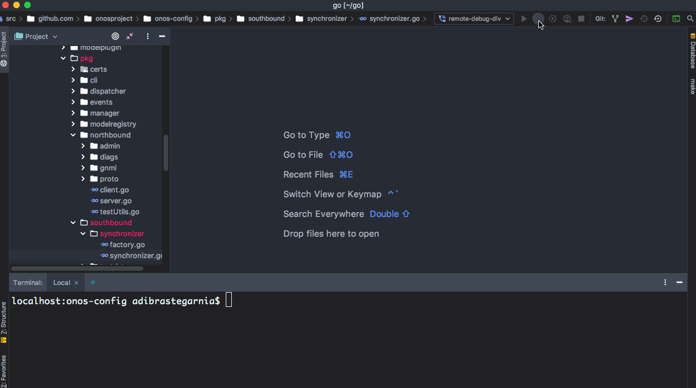
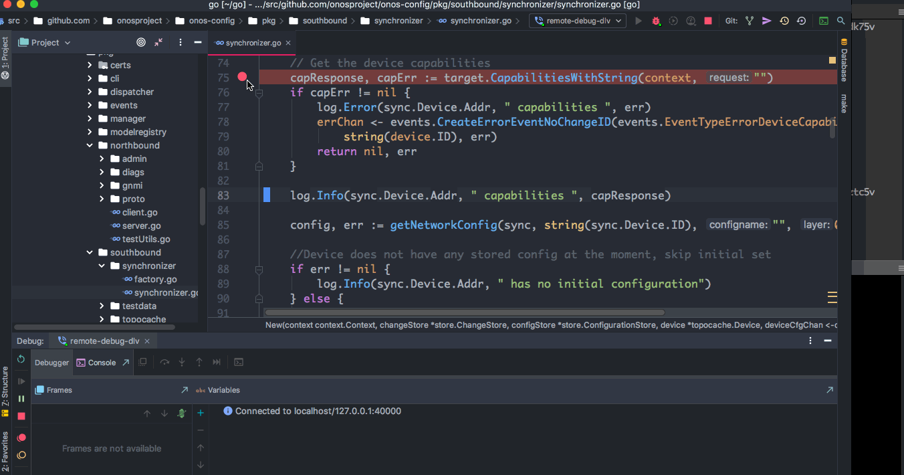
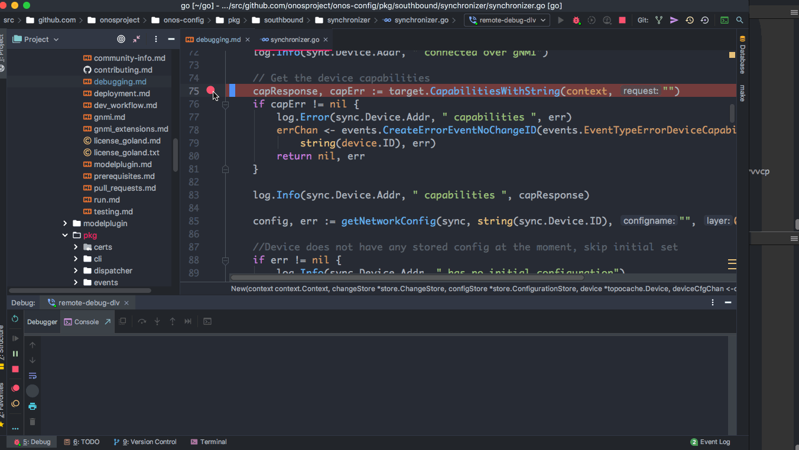

# Debug onos-config in Onit Using Delve

## Debugging Example #1: Use Goland IDE (Recommended):
- In this example, we assume you already started an onit cluster. If you haven't done that yet, refer to [testing](testing.md) for more details.

- First, you need to configure your [Goland](https://www.jetbrains.com/go/) IDE to connect to the remote [Delve](https://github.com/go-delve/delve/tree/master/Documentation/installation) debugger which is running in the onos-config 
pod. You can do that by going to *Run | Edit Configurations… | + | Go Remote* and configuring the host (in this example *localhost*) and port (in this example port **40000**) your remote debugger is listening on.

  

- To start debugging and  open a debugger port to the given resource, you can run `onit debug` command. For example, to forwards a port to the debug port on the onos-config pod, run the following command:
  
```bash
  >onit debug <name of onos-config pod>
  Forwarding from 127.0.0.1:40000 -> 40000
  Forwarding from [::1]:40000 -> 40000
```

- To connect to the debugger using Goland IDE, select the configuration that you created 
in the first step and click on *Debug* button as follows:

   


- If your Goland IDE connects to the debug server which is running in onos-config pod successfully, then you should be able to see the following message in the logs:

```bash
   > onit get logs <name of onos-config pod>
   ....
   2019-07-22T15:09:27Z debug layer=debugger halting
   2019-07-22T15:09:28Z debug layer=debugger continuing
```

- Suppose we want to add a simulator and debug [synchronizer](https://github.com/onosproject/onos-config/blob/master/pkg/southbound/synchronizer/synchronizer.go)
code by setting a few breakpoints in different lines of its file as follows:

   
                 
- As you can see above, after setting the breakpoints, you should be able to see some messages
in the onos-config pod logs that confirm you set the breakpoints. When we add a simulator
 the Goland IDE hits the first breakpoint that was set. At this point you can go through the list 
of variables and goroutines using the debugger dashboard. 

- Suppose we want to have tracepoints instead of breakpoints. Tracepoints don't 
cause the program execution to break and they can be useful when you need to inspect something, 
but not stop the program. To do that in Goland IDE, first set a breakpoint and then 
right-click on the breakpoint and unchecking "Suspend" as follows:

  

- You can also print a *breakpoint hit message*, print *stack trace*, 
and *Evaluate and Log* variables using tracepoints without pausing the program. For example, suppose we want to
print the address of the device simulator in the [synchronizer](https://github.com/onosproject/onos-config/blob/master/pkg/southbound/synchronizer/synchronizer.go)
as we add a device simulator to the onit cluster:

  

## Debugging. Example #2: Use Simple Delve Client:
- In this example, we assume you already started an onit cluster. If you haven't done that yet, refer to [testing](testing.md) for more details. 

- First, you need to install [Delve](https://github.com/go-delve/delve/tree/master/Documentation/installation) on your machine to interact 
with the debugger in the onos-config pod. To make sure the debugger is installed successfully on your machine, run `dlv` command which should show its help. 

- To start debugging and  open a debugger port to the given resource, you can run `onit debug` command. For example, to forwards a port to the debug port on the onos-config pod, run the following command:

```bash
   >onit debug <name of onos-config pod>
     Forwarding from 127.0.0.1:40000 -> 40000
     Forwarding from [::1]:40000 -> 40000
```

- To connect to the debugger server which is running in the onos-config pod, run the following command from another terminal:

```bash
  > dlv connect localhost:40000
    Type 'help' for list of commands.
    (dlv)
```

- If the dlv client connects to the server without any problems, you should be able to see the following message in the logs:
  
```bash
     > onit get logs onos-config-5d56898bdd-zrmt2
     ....
     2019-07-18T20:55:06Z debug layer=debugger halting
```

- To get list of sources that can be used for debugging, run the following command from the dlv CLI:

```bash
    (dlv) sources
    /go/src/github.com/onosproject/onos-config/cmd/onos-config/onos-config.go
    /go/src/github.com/onosproject/onos-config/modelplugin/Devicesim-1.0.0/devicesim_1_0_0/generated.go
    /go/src/github.com/onosproject/onos-config/modelplugin/Devicesim-1.0.0/modelmain.go
    /go/src/github.com/onosproject/onos-config/modelplugin/TestDevice-1.0.0/modelmain.go
    /go/src/github.com/onosproject/onos-config/modelplugin/TestDevice-1.0.0/testdevice_1_0_0/generated.go
    /go/src/github.com/onosproject/onos-config/modelplugin/TestDevice-2.0.0/modelmain.go
    /go/src/github.com/onosproject/onos-config/modelplugin/TestDevice-2.0.0/testdevice_2_0_0/generated.go
    /go/src/github.com/onosproject/onos-config/pkg/dispatcher/dispatcher.go
    /go/src/github.com/onosproject/onos-config/pkg/events/configevent.go
    /go/src/github.com/onosproject/onos-config/pkg/events/events.go
    /go/src/github.com/onosproject/onos-config/pkg/events/operationalevent.go
    /go/src/github.com/onosproject/onos-config/pkg/events/responseevent.go
    /go/src/github.com/onosproject/onos-config/pkg/events/topoevent.go
    /go/src/github.com/onosproject/onos-config/pkg/manager/getconfig.go
    /go/src/github.com/onosproject/onos-config/pkg/manager/manager.go
    /go/src/github.com/onosproject/onos-config/pkg/manager/rollbackconfig.go
    /go/src/github.com/onosproject/onos-config/pkg/manager/setconfig.go
    /go/src/github.com/onosproject/onos-config/pkg/modelregistry/modelregistry.go
    /go/src/github.com/onosproject/onos-config/pkg/northbound/admin/admin.go
    ....
```

- Suppose you want to set a breakpoint at line 83 of [synchronizer](https://github.com/onosproject/onos-config/blob/master/pkg/southbound/synchronizer/synchronizer.go). To do that, run the following command from dlv CLI: 
```bash
    (dlv) break onosproject/onos-config/pkg/southbound/synchronizer/synchronizer.go:83
```

- if you set it properly, you should be able to see a message like the following in the logs:
```bash
    onit get logs onos-config-5d56898bdd-zrmt2
    ...
    2019-07-18T21:03:24Z info layer=debugger created breakpoint: &api.Breakpoint{ID:2, Name:"", Addr:0xcd62a2, File:"/go/src/github.com/onosproject/onos-config/pkg/southbound/synchronizer/synchronizer.go", Line:83, FunctionName:"github.com/onosproject/onos-config/pkg/southbound/synchronizer.New", Cond:"", Tracepoint:false, TraceReturn:false, Goroutine:false, Stacktrace:0, Variables:[]string(nil), LoadArgs:(*api.LoadConfig)(nil), LoadLocals:(*api.LoadConfig)(nil), HitCount:map[string]uint64{}, TotalHitCount:0x0}
```

- Run `continue` from dlv CLI that runs until breakpoint as follows:
 ```bash
    (dlv) continue
```

- Then, add a device simulator using `onit add simulator` command. When onit cluster is trying to add a device simulator to the cluster, the debugger stops at the breakpoint and you should be able to see an output like the following from the dlv CLI:
```bash
    (dlv) continue
    > github.com/onosproject/onos-config/pkg/southbound/synchronizer.New() /go/src/github.com/onosproject/onos-config/pkg/southbound/synchronizer/synchronizer.go:83 (hits goroutine(9):1 total:1) (PC: 0xcd62a2)
```

- In addition, you can check the onos-config logs to make sure the program stops where you expect to stop:
 ```bash
    > onit get logs onos-config-5d56898bdd-zrmt2
    2019-07-18T21:16:32Z debug layer=debugger continuing
    I0718 21:18:09.661372      32 dispatcher.go:103] Registering Device sim1 on channel 0xc000083920 and 0xc000083980
    I0718 21:18:09.662158      32 synchronizer.go:64] Connecting to sim1:10161 over gNMI
    I0718 21:18:09.662369      32 clientManager.go:53] Loading default CA onfca
    I0718 21:18:09.662607      32 clientManager.go:60] Loading default certificates
    I0718 21:18:09.702593      32 synchronizer.go:72] sim1:10161 connected over gNMI
```
- Suppose we set another breakpoint at line 89 of [synchronizer](https://github.com/onosproject/onos-config/blob/master/pkg/southbound/synchronizer/synchronizer.go) and run `continue` command from dlv CLI again. The output of dlv CLI and onos-config logs will be like the followings:

```bash
    (dlv) continue
    > github.com/onosproject/onos-config/pkg/southbound/synchronizer.New() /go/src/github.com/onosproject/onos-config/pkg/southbound/synchronizer/synchronizer.go:89 (hits goroutine(9):1 total:1) (PC: 0xcd64f9)
```

```bash
    > onit get logs onos-config-5d56898bdd-zrmt2
    ...
    2019-07-18T21:25:21Z info layer=debugger created breakpoint: &api.Breakpoint{ID:3, Name:"", Addr:0xcd64f9, File:"/go/src/github.com/onosproject/onos-config/pkg/southbound/synchronizer/synchronizer.go", Line:89, FunctionName:"github.com/onosproject/onos-config/pkg/southbound/synchronizer.New", Cond:"", Tracepoint:false, TraceReturn:false, Goroutine:false, Stacktrace:0, Variables:[]string(nil), LoadArgs:(*api.LoadConfig)(nil), LoadLocals:(*api.LoadConfig)(nil), HitCount:map[string]uint64{}, TotalHitCount:0x0}
    2019-07-18T21:26:51Z debug layer=debugger continuing
    I0718 21:26:51.518797      32 synchronizer.go:83] sim1:10161 capabilities supported_models:<name:"openconfig-interfaces" organization:"OpenConfig working group" version:"2017-07-14" > supported_models:<name:"openconfig-openflow" organization:"OpenConfig working group" version:"2017-06-01" > supported_models:<name:"openconfig-platform" organization:"OpenConfig working group" version:"2016-12-22" > supported_models:<name:"openconfig-system" organization:"OpenConfig working group" version:"2017-07-06" > supported_encodings:JSON supported_encodings:JSON_IETF gNMI_version:"0.7.0"
    I0718 21:26:51.519659      32 synchronizer.go:305] Getting saved config for sim1
```

- if you run `continue` again, it passes the breakpoint at line 89 and onos-config will keep running:
```bash
    > onit get logs onos-config-5d56898bdd-zrmt2
    ...
    2019-07-18T21:45:01Z debug layer=debugger continuing
    I0718 21:45:01.034584      32 synchronizer.go:89] sim1:10161 has no initial configuration
    I0718 21:45:01.053357      32 synchronizer.go:243] subscribe:<prefix:<> subscription:<path:<> sample_interval:15 heartbeat_interval:15 > subscription:<path:<> sample_interval:15 heartbeat_interval:15 > >
```

- At this point, you have two breakpoints in the [synchronizer](https://github.com/onosproject/onos-config/blob/master/pkg/southbound/synchronizer/synchronizer.go). To see list of your breakpoints, you can run `breakpoints` command from dlv CLI.

```bash
    (dlv) breakpoints
    Breakpoint runtime-fatal-throw at 0x6ab830 for runtime.fatalthrow() /usr/local/go/src/runtime/panic.go:663 (0)
    Breakpoint unrecovered-panic at 0x6ab8a0 for runtime.fatalpanic() /usr/local/go/src/runtime/panic.go:690 (0)
        print runtime.curg._panic.arg
    Breakpoint 4 at 0xcd62a2 for github.com/onosproject/onos-config/pkg/southbound/synchronizer.New() /go/src/github.com/onosproject/onos-config/pkg/southbound/synchronizer/synchronizer.go:83 (1)
    Breakpoint 5 at 0xcd64f9 for github.com/onosproject/onos-config/pkg/southbound/synchronizer.New() /go/src/github.com/onosproject/onos-config/pkg/southbound/synchronizer/synchronizer.go:89 (0)
```
You can repeat the above steps by adding another simulator to onos-config and monitor dlv CLI and onos-config pod logs.

### Print Local Variables

- When you set breakpoints in a file, you can also print local variables as you go through the breakpoints. For example, look at the following piece of code from [synchronizer](https://github.com/onosproject/onos-config/blob/master/pkg/southbound/synchronizer/synchronizer.go):

```bash
    target := southbound.Target{}
    key, err := target.ConnectTarget(context, *sync.Device)
    sync.key = key
```

- Suppose we add a simulator and we would like to print the value of key when it passes this block of code. You can use `print` function from dlv CLI to print local variables in the code:

```bash
    (dlv) print key
    github.com/onosproject/onos-config/pkg/southbound.DeviceID {
        DeviceID: "sim2:10161",}
```
or to print `capResponse` variable:

```bash
    (dlv) print capResponse
    *github.com/openconfig/gnmi/proto/gnmi.CapabilityResponse {
        SupportedModels: []*github.com/openconfig/gnmi/proto/gnmi.ModelData len: 4, cap: 4, [
            *(*"github.com/openconfig/gnmi/proto/gnmi.ModelData")(0xc00042e280),
            *(*"github.com/openconfig/gnmi/proto/gnmi.ModelData")(0xc00042e2d0),
            *(*"github.com/openconfig/gnmi/proto/gnmi.ModelData")(0xc00042e320),
            *(*"github.com/openconfig/gnmi/proto/gnmi.ModelData")(0xc00042e370),
        ],
        SupportedEncodings: []github.com/openconfig/gnmi/proto/gnmi.Encoding len: 2, cap: 2, [Encoding_JSON (0),Encoding_JSON_IETF (4)],
        GNMIVersion: "0.7.0",
        Extension: []*github.com/openconfig/gnmi/proto/gnmi_ext.Extension len: 0, cap: 0, nil,
        XXX_NoUnkeyedLiteral: struct {} {},
        XXX_unrecognized: []uint8 len: 0, cap: 0, nil,
        XXX_sizecache: 0,}
```

- You can also check the list of local variables using `locals` command from dlv CLI, for example:

```bash
    (dlv) locals
    sync = ("*github.com/onosproject/onos-config/pkg/southbound/synchronizer.Synchronizer")(0xc000368000)
    capResponse = ("*github.com/openconfig/gnmi/proto/gnmi.CapabilityResponse")(0xc000346d80)
    target = github.com/onosproject/onos-config/pkg/southbound.Target {Destination: (*"github.com/openconfig/gnmi/client.Destination")(0xc0004e00e0), Clt: github.com/onosproject/onos-config/pkg/southbound.GnmiClient(github.com/onosproject/onos-config/pkg/southbound.gnmiClientImpl) *(*"github.com/onosproject/onos-config/pkg/southbound.GnmiClient")(0xc0004e0130), Ctx: context.Context(*context.emptyCtx) ...}
    key = github.com/onosproject/onos-config/pkg/southbound.DeviceID {DeviceID: "sim1:10161"}
    err = error nil
    capErr = error nil
```

### Goroutines 

- To check which goroutine is running when you are going through a piece of code using breakpoints, you can run the following command from dlv CLI:
```bash
    (dlv) goroutine
    Goroutine 12:
        Runtime: /go/src/github.com/onosproject/onos-config/pkg/southbound/synchronizer/synchronizer.go:83 github.com/onosproject/onos-config/pkg/southbound/synchronizer.New (0xcd62a2)
        User: /go/src/github.com/onosproject/onos-config/pkg/southbound/synchronizer/synchronizer.go:83 github.com/onosproject/onos-config/pkg/southbound/synchronizer.New (0xcd62a2)
        Go: /go/src/github.com/onosproject/onos-config/pkg/manager/manager.go:217 github.com/onosproject/onos-config/pkg/manager.(*Manager).Run (0xcdfb0c)
        Start: /go/src/github.com/onosproject/onos-config/pkg/southbound/synchronizer/factory.go:30 github.com/onosproject/onos-config/pkg/southbound/synchronizer.Factory (0xcd4aa0)
```

- To check list of all goroutines which potentially can be running in onos-config, you can run the following command from dlv CLI:
```bash
    (dlv) goroutines
      Goroutine 1 - User: /usr/local/go/src/runtime/netpoll.go:182 internal/poll.runtime_pollWait (0x6a7b5e)
      Goroutine 2 - User: /usr/local/go/src/runtime/proc.go:302 runtime.gopark (0x6ae2c4)
      Goroutine 3 - User: /usr/local/go/src/runtime/proc.go:302 runtime.gopark (0x6ae2c4)
      Goroutine 4 - User: /usr/local/go/src/runtime/proc.go:302 runtime.gopark (0x6ae2c4)
      Goroutine 5 - User: /go/src/github.com/onosproject/onos-config/vendor/k8s.io/klog/klog.go:990 k8s.io/klog.(*loggingT).flushDaemon (0x8227a3)
      Goroutine 6 - User: /go/src/github.com/onosproject/onos-config/vendor/github.com/golang/glog/glog.go:882 github.com/golang/glog.(*loggingT).flushDaemon (0xca8b23)
      Goroutine 7 - User: /usr/local/go/src/runtime/proc.go:302 runtime.gopark (0x6ae2c4)
      Goroutine 8 - User: /usr/local/go/src/runtime/proc.go:302 runtime.gopark (0x6ae2c4)
      Goroutine 9 - User: /go/src/github.com/onosproject/onos-config/pkg/dispatcher/dispatcher.go:58 github.com/onosproject/onos-config/pkg/dispatcher.(*Dispatcher).Listen (0x82a193)
      Goroutine 10 - User: /go/src/github.com/onosproject/onos-config/pkg/dispatcher/dispatcher.go:86 github.com/onosproject/onos-config/pkg/dispatcher.(*Dispatcher).ListenOperationalState (0x82a96b)
      Goroutine 11 - User: /go/src/github.com/onosproject/onos-config/pkg/manager/manager.go:236 github.com/onosproject/onos-config/pkg/manager.listenOnResponseChannel (0xcdfd20)
      Goroutine 12 - User: /go/src/github.com/onosproject/onos-config/pkg/southbound/synchronizer/synchronizer.go:83 github.com/onosproject/onos-config/pkg/southbound/synchronizer.New (0xcd62a2) (thread 60)
      Goroutine 18 - User: /usr/local/go/src/runtime/lock_futex.go:228 runtime.notetsleepg (0x685a74)
      Goroutine 19 - User: /usr/local/go/src/runtime/proc.go:302 runtime.gopark (0x6ae2c4)
      Goroutine 20 - User: /usr/local/go/src/runtime/proc.go:302 runtime.gopark (0x6ae2c4)
      Goroutine 34 - User: /usr/local/go/src/runtime/lock_futex.go:228 runtime.notetsleepg (0x685a74)
      Goroutine 35 - User: /usr/local/go/src/runtime/proc.go:302 runtime.gopark (0x6ae2c4)
      Goroutine 83 - User: /usr/local/go/src/runtime/proc.go:302 runtime.gopark (0x6ae2c4)
      Goroutine 101 - User: /usr/local/go/src/runtime/netpoll.go:182 internal/poll.runtime_pollWait (0x6a7b5e)
      Goroutine 102 - User: /go/src/github.com/onosproject/onos-config/vendor/google.golang.org/grpc/internal/transport/controlbuf.go:317 google.golang.org/grpc/internal/transport.(*controlBuffer).get (0xb54ae3)
      Goroutine 103 - User: /go/src/github.com/onosproject/onos-config/vendor/google.golang.org/grpc/stream.go:320 google.golang.org/grpc.newClientStream.func5 (0xc3492d)
      Goroutine 104 - User: /go/src/github.com/onosproject/onos-config/pkg/southbound/synchronizer/synchronizer.go:130 github.com/onosproject/onos-config/pkg/southbound/synchronizer.(*Synchronizer).syncConfigEventsToDevice (0xcd72a5)
      Goroutine 105 - User: /go/src/github.com/onosproject/onos-config/vendor/google.golang.org/grpc/internal/transport/transport.go:267 google.golang.org/grpc/internal/transport.(*Stream).waitOnHeader (0xb7e542)
    .....
    [49 goroutines]
```

### Debug Your Code Line by Line

- After setting a breakpoint in a source file, you can execute your code line by line  using `next` or `n` command from dlv CLI: For example:
```
    (dlv) n
    > github.com/onosproject/onos-config/pkg/southbound/synchronizer.New() /go/src/github.com/onosproject/onos-config/pkg/southbound/synchronizer/synchronizer.go:88 (PC: 0xcd64e9)
    (dlv) n
    > github.com/onosproject/onos-config/pkg/southbound/synchronizer.New() /go/src/github.com/onosproject/onos-config/pkg/southbound/synchronizer/synchronizer.go:89 (PC: 0xcd64f9)
    (dlv) n
    > github.com/onosproject/onos-config/pkg/southbound/synchronizer.New() /go/src/github.com/onosproject/onos-config/pkg/southbound/synchronizer/synchronizer.go:123 (PC: 0xcd65ec)
    (dlv) n
```

### Print Stack Trace

- To print stack trace, you can run `stack` command as  follows:

```bash
    (dlv) stack
    0  0x0000000000cd62a2 in github.com/onosproject/onos-config/pkg/southbound/synchronizer.New
       at /go/src/github.com/onosproject/onos-config/pkg/southbound/synchronizer/synchronizer.go:83
    1  0x0000000000cd518e in github.com/onosproject/onos-config/pkg/southbound/synchronizer.Factory
       at /go/src/github.com/onosproject/onos-config/pkg/southbound/synchronizer/factory.go:49
    2  0x00000000006dae71 in runtime.goexit
       at /usr/local/go/src/runtime/asm_amd64.s:1337
```