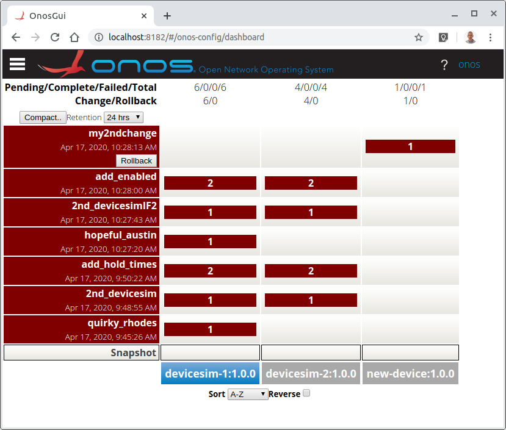
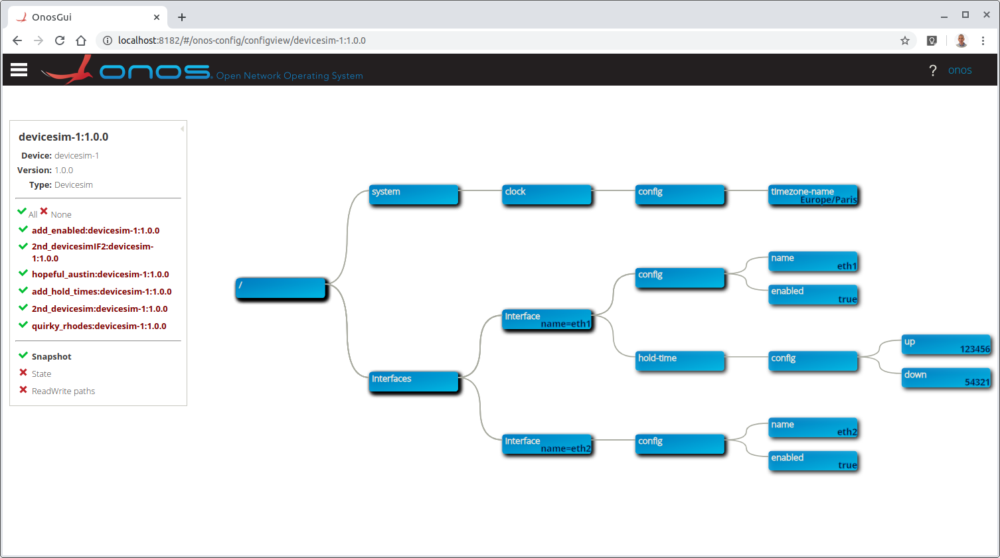

# Northbound gNMI service
The system provides a Northbound gNMI service. gNMI is a specialization of gRPC,
specifically for configuration of systems or devices. In `onos-config` the gNMI
interface is secured through TLS, and is made available on port **5150**.

gNMI extensions supported on the Northbound are described in [gnmi_extensions.md](./gnmi_extensions.md)

The impact of the gNMI changes given below can be visualized by running the
[Configuration Dashboard](https://docs.onosproject.org/onos-gui/docs/config-gui/).

## gnmi_cli utility
A simple way to issue a gNMI requests is to use the `gnmi_cli` utility from
the [OpenConfig](https://github.com/openconfig/gnmi) project.

> A special version of this tool that can connect over a plain connection is available
> on an ONF [fork](https://github.com/opennetworkinglab/gnmi). This version gives
> the extra `-encodingType` (`-en`) and `-tlsDisabled` (`-tls`) options.

More instructions including all the examples below can be found in
[gnmi_cli tool examples](https://github.com/onosproject/onos-config/tree/master/gnmi_cli).

### gnmi_cli utility through onos-cli
> On a deployed cluster the onos-cli pod has this gNMI client installed.

You can run the following command to get in to the **onos-cli** pod and then run gnmi_cli from there:

```bash
kubectl -n micro-onos exec -it $(kubectl -n micro-onos get pods -l type=cli -o name) -- /bin/sh
```

### Accessing from local machine
An alternative is to install on your system, install as follows:
```bash
go get -u github.com/opennetworkinglab/gnmi/cmd/gnmi_cli
```

Then you can use k8s port forwarding to run gnmi_cli locally on your machine as follows:

```bash
kubectl port-forward -n <onos-namespace> <onos-config-pod-id> 5150:5150
```

> For troubleshooting information see [gnmi_user_manual.md](https://github.com/onosproject/gnxi-simulators/blob/master/docs/gnmi/gnmi_user_manual.md)

### Alternate to gNMI SetRequest in onos-cli
For convenience, another method of calling gNMI SetRequest on `onos-config` is
provided through the `onos-cli` tool with [onos config load yaml](./cli.md#Loading configuration data in bulk).
This allows configuration in YAML to be loaded directly in to `onos-config`

## Namespaces
__onos-config__ follows the YGOT project in simplification by not using namespaces in paths. This can be achieved
because the YANG models used do not have clashing device names that need to be qualified by namespaces.
This helps developers, avoiding un-needed complication and redundancy.

## Capabilities
For example use `gnmi_cli -capabilities` to get the capabilities from the system.

```bash
gnmi_cli -capabilities --address=onos-config:5150 \
  -timeout 5s -insecure \
  -client_crt /etc/ssl/certs/client1.crt -client_key /etc/ssl/certs/client1.key -ca_crt /etc/ssl/certs/onfca.crt
```

The Encodings supported are `JSON`, `JSON_IETF`, and `PROTO`.

> This returns the aggregate of all of the model plugins and their versions
> that have been loaded.
>
> Here the certificate locations are inside the `onos-cli` pod.
> If the CA does not exactly match the cert inside `onos-config` and the hostname
> of the server does not match the cert it is necessary to use the `-insecure`
> flag. Encryption is still used in this case.

## Northbound Set Request via gNMI
To make a gNMI Set request, use the `gnmi_cli -set` command as in the example below:

> Since the onos-config data store is empty by default, the Set examples are shown
> before the Get examples (below).

[gnmi](https://github.com/onosproject/onos-config/tree/master/gnmi_cli/set.timezone.gnmi)
```bash
gnmi_cli -address onos-config:5150 -set \
    -proto "update: <path: <target: 'devicesim-1', elem: <name: 'system'> elem: <name: 'clock' > elem: <name: 'config'> elem: <name: 'timezone-name'>> val: <string_val: 'Europe/Paris'>> extension: <registered_ext: <id: 101, msg:'1.0.0'>> extension: <registered_ext: <id: 102, msg:'Devicesim'>>" \
    -timeout 5s -en PROTO -alsologtostderr -insecure \
    -client_crt /etc/ssl/certs/client1.crt -client_key /etc/ssl/certs/client1.key -ca_crt /etc/ssl/certs/onfca.crt
```
giving a response like
```bash
response: <
  path: <
    elem: <
      name: "system"
    >
    elem: <
      name: "clock"
    >
    elem: <
      name: "config"
    >
    elem: <
      name: "timezone-name"
    >
    target: "devicesim-1"
  >
  op: UPDATE
>
timestamp: 1559122191
extension: <
  registered_ext: <
    id: 100
    msg: "c21a1aa5-76d6-11eb-81af-6f6e6f732d63"
  >
>
```

> The result will include a field as a gNMI SetResponse extension 100
> giving randomly generated Network Change identifier, which may be subsequently used
> to rollback the change.
>
> If a specific name is desired for a Network Change, the set may be given in the
SetRequest() with the 100 extension at the end of the -proto section like:
> `, extension: <registered_ext: <id: 100, msg: 'myfirstchange'>>`
> See [gnmi_extensions.md](./gnmi_extensions.md) for more on gNMI extensions supported.
>
> If a name is given a 2nd time, it wil produce an error `rpc error: code = Internal desc = write condition failed`

Checking of the contents is done only when a Model Plugin is
loaded for the device type. 2 checks are done

1. that a attempt is not being made to change a readonly attribute and
2. that valid data types and values are being used.

The config is only forwarded down to the southbound layer only if the config is
correct and the device is currently in the deviceStore.

### Set on multiple targets in one request.
`onos-config` gNMI NB supports setting multiple elements on multiple targets at the same time.   
An example of an attribute on two targets is:

[gnmi](https://github.com/onosproject/onos-config/tree/master/gnmi_cli/set.multipleif.gnmi)
```bash
gnmi_cli -address onos-config:5150 -set \
    -proto "update: <path: <target: 'devicesim-1', elem: <name: 'interfaces'> elem: <name: 'interface' key:<key:'name' value:'eth1' >> elem: <name: 'config'> elem: <name: 'name'>> val: <string_val: 'eth1'>> extension: <registered_ext: <id: 100, msg:'added_devicesim-1-IF'>> update: <path: <target: 'devicesim-2', elem: <name: 'interfaces'> elem: <name: 'interface' key:<key:'name' value:'eth1' >> elem: <name: 'config'> elem: <name: 'name'>> val: <string_val: 'eth1'>> extension: <registered_ext: <id: 101, msg:'1.0.0'>> extension: <registered_ext: <id: 102, msg:'Devicesim'>>" \
    -timeout 5s -alsologtostderr -insecure \
    -client_crt /etc/ssl/certs/client1.crt \
    -client_key /etc/ssl/certs/client1.key \
    -ca_crt /etc/ssl/certs/onfca.crt
```
An example of setting two attributes on two targets:

[gnmi](https://github.com/onosproject/onos-config/tree/master/gnmi_cli/set.multipleif2.gnmi)
```bash
gnmi_cli -address onos-config:5150 -set \
    -proto "update: <path: <target: 'devicesim-1', elem: <name: 'interfaces'> elem: <name: 'interface' key:<key:'name' value:'eth1' >> elem: <name: 'hold-time'> elem: <name: 'config'> elem: <name: 'up'>> val: <uint_val: 123456>> update: <path: <target: 'devicesim-1', elem: <name: 'interfaces'> elem: <name: 'interface' key:<key:'name' value:'eth1' >> elem: <name: 'hold-time'> elem: <name: 'config'> elem: <name: 'down'>> val: <uint_val: 54321>> update: <path: <target: 'devicesim-2', elem: <name: 'interfaces'> elem: <name: 'interface' key:<key:'name' value:'eth1' >> elem: <name: 'hold-time'> elem: <name: 'config'> elem: <name: 'up'>> val: <uint_val: 765432>> update: <path: <target: 'devicesim-2', elem: <name: 'interfaces'> elem: <name: 'interface' key:<key:'name' value:'eth1' >> elem: <name: 'hold-time'> elem: <name: 'config'> elem: <name: 'down'>> val: <uint_val: 234567>> extension: <registered_ext: <id: 100, msg:'add_hold_times'>>" \
    -timeout 5s -alsologtostderr -insecure \
    -client_crt /etc/ssl/certs/client1.crt \
    -client_key /etc/ssl/certs/client1.key \
    -ca_crt /etc/ssl/certs/onfca.crt
```

Adding an "eth2" to each of the devices

[gnmi](https://github.com/onosproject/onos-config/tree/master/gnmi_cli/set.multipleeth2.gnmi)
```bash
gnmi_cli -address onos-config:5150 -set \
    -proto "update: <path: <target: 'devicesim-1', elem: <name: 'interfaces'> elem: <name: 'interface' key:<key:'name' value:'eth2' >> elem: <name: 'config'> elem: <name: 'name'>> val: <string_val: 'eth2'>> extension: <registered_ext: <id: 100, msg:'added_devicesim-1-IF2'>> update: <path: <target: 'devicesim-2', elem: <name: 'interfaces'> elem: <name: 'interface' key:<key:'name' value:'eth2' >> elem: <name: 'config'> elem: <name: 'name'>> val: <string_val: 'eth2'>> extension: <registered_ext: <id: 100, msg:'2nd_devicesimIF2'>> extension: <registered_ext: <id: 101, msg:'1.0.0'>> extension: <registered_ext: <id: 102, msg:'Devicesim'>>" \
    -timeout 5s -alsologtostderr -insecure \
    -client_crt /etc/ssl/certs/client1.crt \
    -client_key /etc/ssl/certs/client1.key \
    -ca_crt /etc/ssl/certs/onfca.crt
```
> There is a quirk with the OpenConfig models (e.g. for Stratum and Devicesim),
> where the name of the interface is a [leaf ref](https://github.com/openconfig/public/blob/e3c0374ce6aa9d1230ea31a5f0f9a739ed0db308/release/models/interfaces/openconfig-interfaces.yang#L164)
> to a name attribute beneath it. This means that an interface cannot be created
> without specifying the config/name attribute at the same time (as above). Otherwise
> error `rpc error: code = InvalidArgument desc = pointed-to value with path ../config/name from field Name value eth2 (string ptr) schema /device/interfaces/interface/name is empty set`
> will occur.

Adding attributes to existing interface

[gnmi](https://github.com/onosproject/onos-config/tree/master/gnmi_cli/set.multipleifenabled.gnmi)
```bash
gnmi_cli -address onos-config:5150 -set \
    -proto "update: <path: <target: 'devicesim-1', elem: <name: 'interfaces'> elem: <name: 'interface' key:<key:'name'value:'eth1'>> elem: <name: 'config'> elem: <name: 'enabled'>> val: <bool_val: true>> update: <path: <target: 'devicesim-1',elem: <name: 'interfaces'> elem: <name: 'interface' key:<key:'name' value:'eth2'>> elem: <name: 'config'> elem: <name: 'enabled'>> val: <bool_val: true>> update: <path: <target: 'devicesim-2', elem: <name: 'interfaces'> elem: <name: 'interface' key:<key:'name' value:'eth1'>> elem: <name: 'config'> elem: <name: 'enabled'>> val: <bool_val: true>> update: <path: <target: 'devicesim-2',elem: <name: 'interfaces'> elem: <name: 'interface' key:<key:'name' value:'eth2'>> elem: <name: 'config'> elem: <name: 'enabled'>> val: <bool_val: true>> extension: <registered_ext: <id: 100,msg:'add_enabled'>>" \
    -timeout 5s -alsologtostderr -insecure \
    -client_crt /etc/ssl/certs/client1.crt \
    -client_key /etc/ssl/certs/client1.key \
    -ca_crt /etc/ssl/certs/onfca.crt
```

### Target device not known/creating a new device target
If the `target` device is not currently known to `onos-config` the system will store the configuration internally and apply
it to the `target` device when/if it becomes available.

When the `target` becomes available `onos-config` will compute the latest configuration for it based on the set of
applied changes and push it to the `target` with a standard `set` operation.

In the case where the `target` device is not known, a special feature of onos-config
has to be invoked to tell the system the type and version to use as a model plugin
for validation - these are given in extensions [101](./gnmi_extensions.md) (version)
and [102](./gnmi_extensions.md) (type).
> This can be used to pre-provision new devices or new versions of devices before
> they are available in the `onos-topo` topology.  

For example using the gnmi_cli:

[gnmi](https://github.com/onosproject/onos-config/tree/master/gnmi_cli/set.targetukn.gnmi)
```bash
gnmi_cli -address onos-config:5150 -set \
    -proto "update: <path: <target: 'new-device', elem: <name: 'system'> elem: <name: 'clock' > elem: <name: 'config'> elem: <name: 'timezone-name'>> val: <string_val: 'Europe/Paris'>>, extension: <registered_ext: <id: 100, msg: 'my2ndchange'>>  , extension <registered_ext: <id: 101, msg: '1.0.0'>>, extension: <registered_ext: <id: 102, msg: 'Devicesim'>>" \
    -timeout 5s -en PROTO -alsologtostderr -insecure \
    -client_crt /etc/ssl/certs/client1.crt -client_key /etc/ssl/certs/client1.key -ca_crt /etc/ssl/certs/onfca.crt
```

> There are restrictions on the use of these extensions in this context:
> * All targets specified in this `set` command will have to be of the same type
> and version as given in extension 101 and 102, even if they already exist on
> the system.

After creating all of these the dashboard will show each Set operation as a row,
and each device as a column.


Drilling down specifically in to "devicesim-1", we can see the layers of
configuration:


## Northbound gNMI Get Request
__onos-config__ extends standard gNMI as a method of accessing a complete
configuration system consisting of *several* devices - each identified by _target_.
It supports network wide configuration actions (multiple
updates on multiple devices at once, and rollback of same).

The gNMI Northbound interface is available through https on port 5150.

> As described in [Key Concepts](run.md), even if the `device-simulator` is connected
> the configuration in `onos-config` will be empty as no initial synchronization
> is done. A Set operation is necessary before a Get will show any results.

### A simple Get operation
Use `gnmi_cli -get` to get configuration for a particular device (target) from the system.
> Use "target" as the identifier of the device, and the "elem" collection is the path to the requested element.
> If config from several devices are required, several paths can be added

[gnmi](https://github.com/onosproject/onos-config/tree/master/gnmi_cli/get.timezone.gnmi)
```bash
gnmi_cli -get -address onos-config:5150 \
    -proto "path: <target: 'devicesim-1', elem: <name: 'system'> elem: <name: 'clock' > elem: <name: 'config'> elem: <name: 'timezone-name'>>" \
    -timeout 5s -en PROTO -alsologtostderr -insecure \
    -client_crt /etc/ssl/certs/client1.crt -client_key /etc/ssl/certs/client1.key -ca_crt /etc/ssl/certs/onfca.crt
```

### List all device names (targets)
A useful way to retrieve all stored device names is with the command:

[gnmi](https://github.com/onosproject/onos-config/tree/master/gnmi_cli/get.alldevices.gnmi)
```bash
gnmi_cli -get -address onos-config:5150 \
    -proto "path: <target: '*'>" \
    -timeout 5s -en PROTO -alsologtostderr -insecure \
    -client_crt /etc/ssl/certs/client1.crt -client_key /etc/ssl/certs/client1.key -ca_crt /etc/ssl/certs/onfca.crt
```

Here the encoding requested was `PROTO` which will returnt the values in a Lef List.
Alternatively `JSON` could have been used, which will give a JSON payload in a JSON_Val.

### List complete configuration for a device (target)

[gnmi](https://github.com/onosproject/onos-config/tree/master/gnmi_cli/get.devicesim1.gnmi)
```bash
gnmi_cli -get -address onos-config:5150 \
    -proto "path: <target: 'devicesim-1'>" \
    -timeout 5s -en PROTO -alsologtostderr -insecure \
    -client_crt /etc/ssl/certs/client1.crt -client_key /etc/ssl/certs/client1.key -ca_crt /etc/ssl/certs/onfca.crt
```
> Here all `elem` components are omitted, which is like requesting '/'. The result
> will be returned as a JSON value.

### Get a keyed index in a list
Use a proto value like:

[gnmi](https://github.com/onosproject/onos-config/tree/master/gnmi_cli/get.connections.gnmi)
```
-proto "path: <target: 'devicesim-1',
         elem: <name: 'system'>
         elem: <name: 'openflow'> elem: <name: 'controllers'>
         elem: <name: 'controller' key: <key: 'name' value: 'main'>>
         elem: <name: 'connections'> elem: <name: 'connection' key: <key: 'aux-id' value: '0'>>
         elem: <name: 'config'> elem: <name: 'address'>>"
```

### Use wildcards in a path
`onos-config` supports the wildcards `*` and `...` in gNMI paths, meaning match
one item of match all items respectively as defined in the gNMI
[specification](https://github.com/openconfig/reference/blob/master/rpc/gnmi/gnmi-path-conventions.md#wildcards-in-paths).

For instance to retrieve all instances of an interface use `*` as the key:

[gnmi](https://github.com/onosproject/onos-config/tree/master/gnmi_cli/get.interfaceswc.gnmi)
```bash
gnmi_cli -get -address onos-config:5150 \
    -proto "path:<target: 'devicesim-1', elem:<name:'interfaces' > elem:<name:'interface' key:<key:'name' value:'*' > > elem:<name:'config'> elem:<name:'enabled' >>" \
    -timeout 5s -en PROTO -alsologtostderr -insecure \
    -client_crt /etc/ssl/certs/client1.crt -client_key /etc/ssl/certs/client1.key -ca_crt /etc/ssl/certs/onfca.crt
```
> This returns the `enabled` config attribute of both interfaces 'eth1' and 'admin'

To retrieve both the config and state values of both then additionally the use
`*` in place of `config`:

[gnmi](https://github.com/onosproject/onos-config/tree/master/gnmi_cli/get.interfaceswc2.gnmi)
```bash
gnmi_cli -get -address onos-config:5150 \
    -proto "path:<target: 'devicesim-1', elem:<name:'interfaces' > elem:<name:'interface' key:<key:'name' value:'*' > > elem:<name:'*'> elem:<name:'enabled' >>" \
    -timeout 5s -en PROTO -alsologtostderr -insecure \
    -client_crt /etc/ssl/certs/client1.crt -client_key /etc/ssl/certs/client1.key -ca_crt /etc/ssl/certs/onfca.crt
```
> If the device is connected and the OperationState cache is populated this returns
> 4 values - `eth1` config and state enabled values and `admin` config and
> state enabled values.

### Device read only state get
To retrieve state attributes (those defined in YANG with `config false`, non-configurable
leafs), in general there is no difference with a normal gNMI Get request.

There is however a `type` qualifier **STATE** in gNMI Get, that allows only
**STATE** values to be requested (excluding any **CONFIG** attributes. For example
to retrieve all the `STATE` values from `devicesim-1`:

[gnmi](https://github.com/onosproject/onos-config/tree/master/gnmi_cli/get.state.gnmi)
```bash
gnmi_cli -get -address onos-config:5150 \
    -proto "path: <target: 'devicesim-1'>, type: STATE" \
    -timeout 5s -en PROTO -alsologtostderr -insecure \
    -client_crt /etc/ssl/certs/client1.crt -client_key /etc/ssl/certs/client1.key -ca_crt /etc/ssl/certs/onfca.crt
```

> The set of possible values for type are: `ALL`, `STATE`, `CONFIG` and `OPERATIONAL`.
> If not specified `ALL` is the default `type`.
> In onos-config there is no distinction made between `STATE` and `OPERATIONAL`
> and requesting either will get both.
> This `type` can be combined with any other proto qualifier like `elem` and `prefix`

## Northbound Delete Request via gNMI
A delete request in gNMI is done using the set request with `delete` paths instead of `update` or `replace`.
To make a gNMI Set request do delete a path, use the `gnmi_cli -set` command as in the example below:

[gnmi](https://github.com/onosproject/onos-config/tree/master/gnmi_cli/delete.timezone.gnmi)
```bash
gnmi_cli -address onos-config:5150 -set \
    -proto "delete: <target: 'devicesim-1', elem: <name: 'system'> elem: <name: 'clock' > elem: <name: 'config'> elem: <name: 'timezone-name'>>" \
    -timeout 5s -en PROTO -alsologtostderr -insecure \
    -client_crt /etc/ssl/certs/client1.crt -client_key /etc/ssl/certs/client1.key -ca_crt /etc/ssl/certs/onfca.crt
```

## Northbound Subscribe Request for Stream Notifications via gNMI
Similarly, to make a gNMI Subscribe request for streaming, use the `gnmi_cli` command as in the example below,
please note the `0` as subscription mode to indicate streaming:

[gnmi](https://github.com/onosproject/onos-config/tree/master/gnmi_cli/subscribe.mode0.gnmi)
```bash
gnmi_cli -address onos-config:5150 \
    -proto "subscribe:<mode: 0, prefix:<>, subscription:<path: <target: 'devicesim-1', elem: <name: 'system'> elem: <name: 'clock' > elem: <name: 'config'> elem: <name: 'timezone-name'>>>>" \
    -timeout 5s -en PROTO -alsologtostderr -insecure \
    -client_crt /etc/ssl/certs/client1.crt -client_key /etc/ssl/certs/client1.key -ca_crt /etc/ssl/certs/onfca.crt
```

> This command will block until there is a change at the requested value that gets
> propagated to the underlying stream. Also as per `gnmi_cli` behaviour the updates get printed twice.

## Northbound Subscribe Once Request via gNMI
Similarly, to make a gNMI Subscribe Once request, use the `gnmi_cli` command as in the example below,
please note the `1` as subscription mode to indicate to send the response once:

[gnmi](https://github.com/onosproject/onos-config/tree/master/gnmi_cli/subscribe.mode1.gnmi)
```bash
gnmi_cli -address onos-config:5150 \
    -proto "subscribe:<mode: 1, prefix:<>, subscription:<path: <target: 'devicesim-1', elem: <name: 'system'> elem: <name: 'clock' > elem: <name: 'config'> elem: <name: 'timezone-name'>>>>" \
    -timeout 5s -en PROTO -alsologtostderr -insecure \
    -client_crt /etc/ssl/certs/client1.crt -client_key /etc/ssl/certs/client1.key -ca_crt /etc/ssl/certs/onfca.crt
```

> This command will fail if no value is set at that specific path. This is due to limitations of the gnmi_cli.

## Northbound Subscribe Poll Request via gNMI
Similarly, to make a gNMI Subscribe POLL request, use the `gnmi_cli` command as in the example below,
please note the `2` as subscription mode to indicate to send the response in a polling way every `polling_interval`
specified seconds:

[gnmi](https://github.com/onosproject/onos-config/tree/master/gnmi_cli/subscribe.mode2.gnmi)
```bash
gnmi_cli -address onos-config:5150 -polling_interval 5s \
    -proto "subscribe:<mode: 2, prefix:<>, subscription:<sample_interval: 5, path: <target: 'devicesim-1', elem: <name: 'system'> elem: <name: 'clock' > elem: <name: 'config'> elem: <name: 'timezone-name'>>>>" \
    -timeout 5s -en PROTO -alsologtostderr -insecure \
    -client_crt /etc/ssl/certs/client1.crt -client_key /etc/ssl/certs/client1.key -ca_crt /etc/ssl/certs/onfca.crt
```
> This command will fail if no value is set at that specific path. This is due to limitations of the gnmi_cli.
