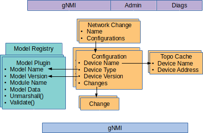

<!--
SPDX-FileCopyrightText: 2019-present Open Networking Foundation <info@opennetworking.org>

SPDX-License-Identifier: Apache-2.0
-->

# gNMI extensions on the Northbound interface

gNMI is designed primarily as a device management interface, and augmenting it
with the extra functionality to do network wide configuration management
across many devices requires some extension.

## Use of target in the NBI
In gNMI the Path type is comprised of a set of path elements and a `target`.
In the onos-config NBI this target represents the `name of the device` as it
is held in the configuration system. Configurations can be explored through the
onos cli like:
```bash
> onos config get configs
Device2-2.0.0	(Device2)	2.0.0	TestDevice	2019-05-09T18:00:00+01:00
	oOqIgEg82ZvVcF7Q3xEDpWAoPcw=
stratum-sim-1-1.0.0	(stratum-sim-1)	1.0.0	Stratum	2019-06-05T11:03:17+01:00
	hPE88W6rrt5TskCTxtoB1n0hr3I=
...
```
> In the example above `stratum-sim-1` is the device associated with the
> configuration `stratum-sim-1-1.0.0`.

Therefore when using a gNMI client like gnmi_cli (see [gnmi.md](./gnmi.md)) the
target can be specified like
```bash
gnmi_cli -get -address localhost:5150 \
    -proto "path: <target: 'stratum-sim-1', elem: <name: 'system'> elem:<name:'config'> elem: <name: 'motd-banner'>>" \
...
```

The following rules apply when a _prefix_ is present in the request:

* The target in the prefix always takes precedence over any others
* If no target is given in the prefix it is an error

### Special case to get all device names
When doing a GetRequest if `*` is given as a `target` then the request returns a simple listing of all device names present in the system (with their version). Any path elements are ignored in this special case.


## Managing configuration objects
The diagram shows the internal storage structures of onos-config (in orange). The
Configuration object represents the complete configuration for a particular
version of a device.

Network changes can be applied across multiple Configurations (devices), and have
the ability to be rolled back (by the name of the Network Change).
 


3 different extensions have been chosen in the project to make dealing with Network
Changes and Configurations through gNMI possible.

### Use of Extension 100 (network change name) in SetRequest and SetResponse
In onos-config the gNMI extension number 100 has been reserved for the
`network change name`.

#### SetRequest
In the SetRequest extension 100 can be used to define a name for the Network
change. If it is not specified then a name is picked automatically.
> There is an example of setting this extension when using gnmi_cli in
[gnmi.md](gnmi.md) (Northbound Set Request via gNMI)

#### SetResponse
In the SetResponse the name of the Network Change will always be given in
extension 100 (either the given name or the generated one).
>There is an example of the return of this extension through `gnmi_cli` in
[gnmi.md](gnmi.md) (Northbound Set Request via gNMI)

### Use of Extension 101 (device version) in SetRequest
Extension 101 is used to set the Model version for a Configuration (as part of a
Network Change). There may be multiple different configurations for a device based
on version number. This extension allows the correct version of the configuration
to be chosen.

If a version is given where no existing Configuration exists, an error is
returned explaining that device type (extension 102 - see below) should also be
specified.

If no extension 101 (version) is given, and only one Configuration already exists
for that device (target), then the change is applied to that Configuration.

### Use of Extension 102 (device type) in SetRequest
The target in the SetRequest contains the device name, but this is not enough to
create a new Configuration if one does not exist - 3 pieces of information are
required - the device name, the device type and the version (see diagram above).

Extension 102 is used to set the `device type`. If a Configuration already exists
for this device name and version and its device type is different to what's
given in extension 101, then an error is returned.

### Use of Extension 103 (list of devices disconnected) in GetResponse, SetResponse, SubscribeResponse
In onos-config the gNMI extension number 103 has been reserved for the
`list of devices disconnected`. The changes and device configuration is still valid and held 
by onos-config until the device arrives in the network. 

#### GetResponse and SetResponse
In the GetResponse and GetRequest the `103` extension has an attached message containing a comma separated
list of devices, e.g `device1,device2,device3` signaling which devices in the request are not
yet connected to onos-config. 

#### SubscribeResponse
In the SubscribeResponse the `103` extension has an attached message containing a single device, 
e.g `device1` signaling that the device in the request is not yet connected to onos-config but 
a configuration object has been changed. in Subscribe there is one device per response since it's
a 1:1 relationship path to update, where the path include one device. 
