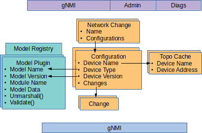

# Extending onos-config with Model Plugins

onos-config is an extensible configuration management system, that allows the
configuration of many different types and versions of devices to be managed
concurrently.

Information models in YANG format (RFC 6020) can be used to accurately define
the configuration and state objects and attributes of a device. In practice a
device's object model usually comprises of a number of YANG files including
augments and deviations, and must be considered as a combined unit.

In _onos-config_ a set of these combined YANG files defining a particular
version of a device type is known as a `model`.

Over its lifecycle onos-config will have to deal with many different models as
its scope is expanded and as devices go through new release cycles. To allow
this models are loadable dynamically as plugins in the form of Linux or Mac
shared object libraries `(\*.so)` using the YGOT library and are know as
**Model Plugins**.

The diagram shows the connection between the Model Plugin and the configuration
store - linked by Device Type and Version. Effectively the primary key
of the Model Registry is the Model Name and Version, whereas the primary key of
the Configuration is the Device Name and Version. 



## Role of the Model Plugin
The Model Plugin enables the following functionality in _onos-config_:

1. Ensures that illegal values are not saved in to the configuration (this covers
wrong data type, data values beyond range or not matching a pattern, lists that
are not within their cardinality limits)
1. Ensuring that read only values are not allowed to be set
1. Checking the validity of stores on startup
1. Enabling the Operational State cache within onos-config 
1. Enabling the retrieval of attributes by type - CONFIG or OPERATIONAL
1. Enabling clients to access the model metadata through the Admin NBI
1. Enabling JSON Payloads in gNMI SetRequests to be interpreted

## Structure of a Model Plugin
A Model Plugin is mainly generated by the generator command from the YGOT
project, and a wrapper `modelmain.go` implementing the ModelPlugin interface.
They are compiled together with the `go build` command using the
`-buildmode=plugin` option. 

Many examples of Model Plugins are in the [modelplugin](../modelplugin)
folder of this project, and an example script
[ModelGenerator.sh](https://github.com/onosproject/onos-config/blob/master/modelplugin/ModelGenerator.sh) is available for creating
new plugins.

### ModelPlugin Interface
The model plugin must implement the `ModelPlugin` interface. This will allow
it to be entered in to the Model Registry.
```go
type ModelPlugin interface {
	ModelData() (string, string, []*gnmi.ModelData, string)
	UnmarshalConfigValues(jsonTree []byte) (*ygot.ValidatedGoStruct, error)
	Validate(*ygot.ValidatedGoStruct, ...ygot.ValidationOption) error
	Schema() (map[string]*yang.Entry, error)
}
``` 

### Create your own Model Plugin using script
1. Change directory in to onos-config/modelplugins
1. Copy anyone of the `.env` files to a new file
1. Edit the variables at the top of the file to suit your plugin (see
`modelmain.go` Definitions below for specifics), taking special care that the
entries in MODELDATA are in alphabetical order (YANGDATA is derived from the
MODELDATA but can be overridden if required)
1. Make sure the required Yang files are present in the `./yang` folder and named properly
1. Run the script like
```bash
> ./ModelGenerator.sh <filename>.env
```

Once the files are created:

1. Change directory back to _onos-config_
2. Compile the plugin with (replacing the names as appropriate)
```bash
> GO111MODULE=on CGO_ENABLED=1 go build -o modelplugin/TestDevice-1.0.0/testdevice.so.1.0.0 -buildmode=plugin -tags=modelplugin ./modelplugin/TestDevice-1.0.0
```

Edit the Makefile to include the Model Plugin in the build (or alternatively
create a new Makefile if you want to keep it in a separate project)

Follow the steps in **Loading the Model Plugin** below for how to load it.

## YANG files
The YANG files to be used with generator.go should be collected together in a
folder and named in the style: `\<modulename>@\<latestrevision>.yang`

> **Note** The Yang files provided are required not to contain overlapping or clashing namespaces at the same path level.
> This requirement is necessary during the model compilation in YGOT because this tool offers no support for namespaces 
> in the form of `/namespace:path/path2`, e.g. `/openconfig-system:system/clock`. YGOT compilation of a model containing 
> `/openconfig-system:system/clock` will result in the path being `/system/clock`

Running the generator command in the form:
```bash
> go run $GOPATH/src/github.com/openconfig/ygot/generator/generator.go \
-path yang -output_file=$TYPEVERSION/$TYPEVERSIONPKG/generated.go -package_name=$TYPEVERSIONPKG \
-generate_fakeroot $YANGLIST
```
will check all nested dependencies are present, _and_ that the output is
generated as a single file: `generated.go`.
> Where $YANGLIST is a space separated list of YANG file names.
> See ModelGenerator.sh for an example

To visualize and further validate the collection of YANG files, the
**[pyang](https://github.com/mbj4668/pyang)** tool can be used like:
```bash
> pyang -f tree $YANGLIST
```
> Once the generator has run there is no need to persist the YANG files - the
> generated.go file contains all the information in an object model.


## modelmain.go definitions
Examples of these definitions are given in the `*.env` files in the modelplugins folder.

### modeltype
This should be a name that defines the type of device, but should not include
version. This name will be used later in the `Configuration` of the device.
It should be between 4 and 40 chars and only include alphanumeric characters,
dash, underscore and colon.

### modelversion
This should be the version number of the device in [Semantic Versioning](https://semver.org/)
form. Only numeric characters and '.' character are allowed.

### modulename
This should be the same as the filename given to the Model Plugin when compiled.
It comprises

* the modeltype (converted to lower case),
* concatenated with '.so.' and
* the version.

e.g. devicesim.so.1.0.0 

### modeldata
The primary YANG files of the device should be listed in the ModelData section
of the `modelmain.go` file. These are the YANG files that define the top level
containers and lists. During compilation other YANG files may get pulled in
because they define reusable types (but should not be listed in model data).

Each entry in modeldata should be in the format of

* name - the name of the `module` inside the YANG file
* version - the value of the `latest` revision inside the YANG file in the
format YYYY-MM-DD
* organization - the value from the `organization` field of the YANG file

> There should be no duplicate entries (of name) in the list and the list should be ordered alphabetically.

# Loading the Model Plugin
The Model Plugin can be loaded at the start up of onos-config by specifying the
-modelPlugin argument.
```bash
-modelPlugin=$HOME/go/src/github.com/onosproject/onos-config/modelplugin/TestDevice-1.0.0/testdevice.so.1.0.0 \
-modelPlugin=$HOME/go/src/github.com/onosproject/onos-config/modelplugin/TestDevice-2.0.0/testdevice.so.2.0.0 \
-modelPlugin=$HOME/go/src/github.com/onosproject/onos-config/modelplugin/Devicesim-1.0.0/devicesim.so.1.0.0 \
-modelPlugin=$HOME/go/src/github.com/onosproject/onos-config/modelplugin/Stratum-1.0.0/stratum.so.1.0.0
```
Alternatively these can be loaded later with the onos cli tool - see [cli.md](./cli.md).
```bash
> onos config add plugin <full path on target machine to shared object model>
```
> Model Plugins cannot be unloaded once loaded, without restarting onos-config.

To see a list of loaded plugins use the command:
```bash
> onos config get plugins
```
which gives an output like:
```bash
> onos config get plugins
TestDevice: 1.0.0 from testdevice.so.1.0.0 containing:
YANGS:
	test1	2018-02-20	Open Networking Foundation

TestDevice: 2.0.0 from testdevice.so.2.0.0 containing:
YANGS:
	test1	2019-06-10	Open Networking Foundation

Devicesim: 1.0.0 from devicesim.so.1.0.0 containing:
YANGS:
	openconfig-interfaces	2017-07-14	OpenConfig working group
	openconfig-openflow	2017-06-01	OpenConfig working group
	openconfig-platform	2016-12-22	OpenConfig working group
	openconfig-system	2017-07-06	OpenConfig working group

Stratum: 1.0.0 from stratum.so.1.0.0 containing:
YANGS:
        openconfig-interfaces                 2.4.1    OpenConfig working group
        openconfig-if-ip                      3.0.0    OpenConfig working group
        openconfig-lacp                       1.1.1    OpenConfig working group
        openconfig-platform                   0.12.2   OpenConfig working group
        openconfig-platform-linecard          0.1.1    OpenConfig working group
        openconfig-platform-port              0.3.2    OpenConfig working group
        openconfig-platform-transceiver       0.7.0    OpenConfig working group
        openconfig-vlan                       3.2.0    OpenConfig working group
        openconfig-system                     0.7.0    OpenConfig working group
        openconfig-hercules-platform-linecard 0.2.0    OpenConfig working group
        openconfig-hercules-qos               0.1.0    OpenConfig working group
        openconfig-hercules-platform          0.2.0    OpenConfig working group
        openconfig-hercules-platform-chassis  0.2.0    OpenConfig working group
        openconfig-hercules-platform-port     0.2.0    OpenConfig working group
        openconfig-hercules                   0.2.0    OpenConfig working group
        openconfig-hercules-interfaces        0.2.0    OpenConfig working group
        openconfig-hercules-platform-node     0.2.0    OpenConfig working group
```

To see a list of Read-Only and Read-Write paths use the command:

```bash
> onos config get plugins -v
```

>In a distributed installation the ModelPlugin will have to be loaded
>on all running instances of onos-config.

# Model Plugins and gNMI Capabilities
## Capabilities on gNMI Northbound interface
The CapabilitiesResponse on the gNMI northound interface is generated dynamically
from the `modeldata` section of all of the loaded Model Plugins.

## Capabilities comparison on Southbound gNMI interface
At runtime when devices are connected to onos-config the response to the
Capabilities request are compared with the
modeldata for their corresponding ModelPlugin - if there is not an exact
match a warning is displayed.

# OpenConfig Models
Some devices that support OpenConfig Models report their capabilities using an
OpenConfig versioning scheme e.g. 0.5.0, rather than the YANG revision date in
the format 2017-07-06. If the device can correct its capabilities to give the
revision then it should to be more consistent with non OpenConfig YANG models.

Accessing OpenConfig model of a specific revision requires a number of steps in
[Github](https://github.com/openconfig/public).

For instance if a device reports it used openconfig-interfacess.yang `2.0.0`,
then to get this file do:

* Browse to [openconfig-interfaces.yang](https://github.com/openconfig/public/blob/master/release/models/interfaces/openconfig-interfaces.yang)
* Observe in the list of `revision` items in the YANG file that the reference
`2.0.0` corresponds to a release date of `2017-07-14`
* Click in the `History` button
* In the `History` page for this file, see that the next commit after this
date was on `Aug 9, 2017`
* Click on the related `commit message`
* In the list of files modified in that commit click the `...` next to the file
`openconfig-interfacess.yang` and choose `View File`
* In the page that displays the historical version of the file, click the `Raw` button
* In the resulting raw display of the YANG file verify that the latest revision is `2017-07-14`
* Save the file locally as `openconfig-interfaces@2017-07-14.yang`

All the files in the [yang](../modelplugin/yang) folder were downloaded in this
way. They are not strictly needed once `generated.go` has been created, but are
kept here for convenience, saving to have to run the procedure above if a change
was needed.

> If the generator program reports that a dependency was required e.g.
`openconfig-inet-types.yang` then the version of this file with a date equal
to or before 2017-07-14 should be downloaded - it is `openconfig-inet-types@2017-07-14.yang`

## Readonly paths in OpenConfig models
When an item in an Openconfig YANG file has "config false" it is effectively a
read-only attribute. Usually with OpenConfig read-only objects are interspersed
throughout the YANG model.

To see a list of Read Only paths use the command:
```bash
> onos config get plugins -v
```

When the Model Plugin is loaded, setting of an attribute like `state/address`
should give an appropriate error

```bash
> gnmi_cli -address onos-config:5150 -set \
    -proto "update: <path: <target: 'devicesim-1', elem: <name: 'system'> elem: <name: 'openflow'> elem: <name: 'controllers'> elem: <name: 'controller' key: <key: 'name' value: 'main'>> elem: <name: 'connections'> elem: <name: 'connection' key: <key: 'aux-id' value: '0'>> elem: <name: 'state'> elem: <name: 'address'>> val: <string_val: '192.0.2.11'>>" \
    -timeout 5s -en PROTO -alsologtostderr \
    -client_crt /etc/ssl/certs/client1.crt -client_key /etc/ssl/certs/client1.key -ca_crt /etc/ssl/certs/onfca.crt
```
gives the error:
```bash
rpc error: code = InvalidArgument desc = update contains a change to a read only
  path /system/openflow/controllers/controller[name=main]/connections/connection[aux-id=0]/state/address. Rejected
```


